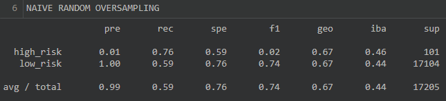
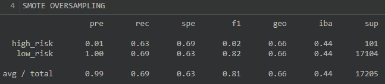
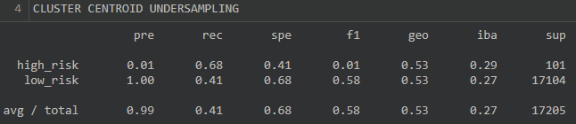
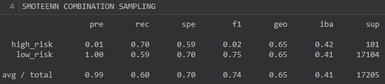
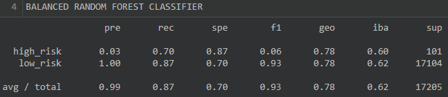
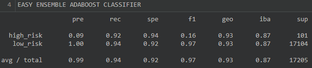

# Credid Risk Analysis

## Overview
Credit risk is an inherently unbalanced classification problem, as good loans easily outnumber risky loans. Therefore, different techniques need to be used to train and evaluate models with unbalanced classes. The imbalanced-learn and scikit-learn libraries will be used on the credit card dataset from LendingClub, a peer-to-peer lending services company, to build and evaluate models using resampling. The purpose of this analysis is to evaluate the performance of machine learning models and recommend whether they should be used to predict credit risk. These were completed as part of the analysis:

- oversample the data using the `RandomOverSampler` and `SMOTE` algorithms  
- undersample the data using the `ClusterCentroids` algorithm  
- use a combinatorial approach of over- and undersampling using the `SMOTEENN` algorithm  
- compare two new machine learning models that reduce bias, `BalancedRandomForestClassifier` and `EasyEnsembleClassifier`  

## Results
### Naïve Random Oversampling

**Balanced Accuracy Score**: 0.68  
**Precision Score**: High Risk = 0.01, Low Risk = 1.00  
**Recall Score**: High Risk = 0.76, Low Risk = 0.59

This model was only accurate for about 68% of the time. It guesses correctly more than half the time, but it still not a great rate.

### SMOTE Oversampling

**Balanced Accuracy Score**: 0.66  
**Precision Score**: High Risk = 0.01, Low Risk = 1.00  
**Recall Score**: High Risk = 0.63, Low Risk = 0.69

This model was only accurate for about 66% of the time. Like the previous model, this model guesses correctly more than half the time, but still not good enough to be reliable.

### Cluster Centroid Undersampling

**Balanced Accuracy Score**: 0.55  
**Precision Score**: High Risk = 0.01, Low Risk = 1.00  
**Recall Score**: High Risk = 0.68, Low Risk = 0.41

This model was only accurate for about 55% of the time. It is only slightly above 50%, which is quite low to be used as a reliable model.

### SMOTEENN Combination

**Balanced Accuracy Score**: 0.65
**Precision Score**: High Risk = 0.01, Low Risk = 1.00  
**Recall Score**: High Risk = 0.70, Low Risk = 0.59

This model was only accurate for about 65% of the time. Like the Naive Random Oversampling and SMOTE Oversampling models, it not a great rate.

### Balanced Random Forest Classifier

**Balanced Accuracy Score**: 0.79  
**Precision Score**: High Risk = 0.03, Low Risk = 1.00  
**Recall Score**: High Risk = 0.70, Low Risk = 0.87

This model was accurate about 79% of the time. This model performed better than all of the previous models by at least 10%. 

### Easy Ensemble AdaBoost Classifier

**Balanced Accuracy Score**: 0.93  
**Precision Score**: High Risk = 0.09, Low Risk = 1.00  
**Recall Score**: High Risk = 0.92, Low Risk = 0.94

This model was accurate about 93% of the time which indicates that it is very likely to make correct guesses.

### Summary
The model that performed the worst was the Cluster Centroid Undersampling model. The best performing models was the Easy Ensemble AdaBoost Classifier Model. Every model tested had a low risk precision score of 1. Most models had a high risk precision score of 0.01, except the Balanced Random Forest Classifier (0.03) and the Easy Ensemble AdaBoost Classifier (0.09). 

### Recommendation
If a lending company values profitability, I would recommend the Easy Ensemble AdaBoost Classifier. This model has a high recall score for both high risk and low risk, meaning that it correctly classifies 92% of the high risk loans and correctly classifies 94% of the low risk loans. The model also has a high balanced accuracy rate (0.93), meaning that 93% of all the machine’s guesses are correct. Comparing the balanced accuracy score, the precision score, and the recall scores, we can see that the Easy Ensemble AdaBoost model outperformed the rest of the models.
